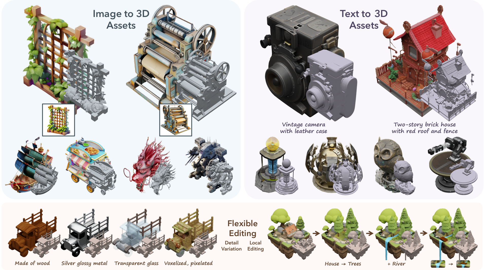

<h1 align="center">TRELLIS_fvdb: Unofficial Implementation of Structured 3D Latents for Scalable and Versatile 3D Generation in fvdb.</h1>


<h1 align="center">Structured 3D Latents<br>for Scalable and Versatile 3D Generation</h1>
<p align="center"><a href="https://arxiv.org/abs/2412.01506"></a>
<a href='https://trellis3d.github.io'></a>
<a href='https://huggingface.co/spaces/JeffreyXiang/TRELLIS'></a>
</p>
<p align="center"></p>

<span style="font-size: 16px; font-weight: 600;">T</span><span style="font-size: 12px; font-weight: 700;">RELLIS</span> is a large 3D asset generation model. It takes in text or image prompts and generates high-quality 3D assets in various formats, such as Radiance Fields, 3D Gaussians, and meshes. The cornerstone of <span style="font-size: 16px; font-weight: 600;">T</span><span style="font-size: 12px; font-weight: 700;">RELLIS</span> is a unified Structured LATent (<span style="font-size: 16px; font-weight: 600;">SL</span><span style="font-size: 12px; font-weight: 700;">AT</span>) representation that allows decoding to different output formats and Rectified Flow Transformers tailored for <span style="font-size: 16px; font-weight: 600;">SL</span><span style="font-size: 12px; font-weight: 700;">AT</span> as the powerful backbones. We provide large-scale pre-trained models with up to 2 billion parameters on a large 3D asset dataset of 500K diverse objects. <span style="font-size: 16px; font-weight: 600;">T</span><span style="font-size: 12px; font-weight: 700;">RELLIS</span> significantly surpasses existing methods, including recent ones at similar scales, and showcases flexible output format selection and local 3D editing capabilities which were not offered by previous models.

***Check out our [Project Page](https://trellis3d.github.io) for more videos and interactive demos!***

<!-- Features -->
## 🌟 Features
- **High Quality**: It produces diverse 3D assets at high quality with intricate shape and texture details.
- **Versatility**: It takes text or image prompts and can generate various final 3D representations including but not limited to *Radiance Fields*, *3D Gaussians*, and *meshes*, accommodating diverse downstream requirements.
- **Flexible Editing**: It allows for easy editings of generated 3D assets, such as generating variants of the same object or local editing of the 3D asset.
- **fvdb**: It provides faster startup and more straightforward sparse tensor operations. 

## 😲 Disclaimer
- I have implemented the complete inference process (image to 3D), with major modifications in the SLAT part. The global processing uses the VDBTensor wrapper from fvdb. However, the training process is not included, and I cannot guarantee that there are no bugs (the inference flow has been tested, and the visualization results are reliable).

- In the inference process, attention is implemented using xformers instead of flash-attn.

- The version of fvdb used here is not the original, as some necessary modifications have been made. For more details, please refer to the related [issue](https://github.com/AcademySoftwareFoundation/openvdb/issues/2030).

- This library has not been rigorously tested for performance!

- If you have any questions or concerns, please feel free to contact me or raise an issue.

## 📦 Installation

### Prerequisites
- **System**: The code is currently tested only on **Linux**. **NOTE**: fvdb only support Linux.
- **Hardware**: The code has been verified on NVIDIA A40 and A4500 GPUs.  
- **Software**:   
  - The [CUDA Toolkit](https://developer.nvidia.com/cuda-toolkit-archive) is needed to compile certain submodules. The code has been tested with CUDA version 12.0. You can use the yaml file to create a new env.
  - [Conda](https://docs.anaconda.com/miniconda/install/#quick-command-line-install) is recommended for managing dependencies.  
  - Python version 3.8 or higher is required. 
  - only [xformers](https://github.com/facebookresearch/xformers)

### Installation Steps
1. Clone the repo:
    ```sh
    git clone --recurse-submodules https://github.com/xiaoc57/TRELLIS_fvdb.git
    cd TRELLIS_fvdb
    ```

2. Install [fvdb](https://github.com/xiaoc57/openvdb/blob/feature/fvdb/fvdb/README.md#L75) and the dependencies:

    **(Optional) Install libMamba for a huge quality of life improvement when using Conda**
    ```
    conda update -n base conda
    conda install -n base conda-libmamba-solver
    conda config --set solver libmamba
    ```    
    
    Create a new conda environment named `fvdb` and install the dependencies:
    ```sh
    conda env create -f openvdb/fvdb/env/dev_environment.yml
    conda activate fvdb
    ```

    ### Install dependencies

    ```sh
    pip install -r requirements.txt
    # only xformers not support flash-attn
    pip install xformers==0.0.27.post2 --index-url https://download.pytorch.org/whl/cu121
    # for gaussian splatting render
    git clone git@github.com:autonomousvision/mip-splatting.git /tmp/extensions/mip-splatting
    pip install /tmp/extensions/mip-splatting/submodules/diff-gaussian-rasterization/

    # reinstall !!!!!!!!!!!
    pip install torchvision==0.19.0 torchaudio==2.4.0 --index-url https://download.pytorch.org/whl/cu121
    ```

    ### Building *f*VDB

    **:warning: Note:** Compilation can be very memory-consuming. We recommend setting the `MAX_JOBS` environment variable to control compilation job parallelism with a value that allows for one job every 2.5GB of memory:

    ```bash
    cd openvdb/fvdb
    export MAX_JOBS=$(free -g | awk '/^Mem:/{jobs=int($4/2.5); if(jobs<1) jobs=1; print jobs}')
    ```

    You could either perform an editable install with setuptools:
    ```shell
    python setup.py develop
    ```
    or install a 'read-only' copy to your site package folder:
    ```shell
    pip install .
    ```
    Then, you will success to install fvdb.
    ```bash
    cd ../../
    ```

    ### Download the ckpts
    You should download these ckpts from [Hugging Face](https://huggingface.co/JeffreyXiang/TRELLIS-image-large/tree/main/ckpts)

    ### modify the ckpt(slat_flow_img_dit_L_64l8p2_fp16.safetensors)
    You should run this script to modify the weights' shape and copy ckpts/slat_flow_img_dit_L_64l8p2_fp16.json to ckpts/slat_flow_img_dit_L_64l8p2_fp16_modified.json.
    You can also modify the origin files.
    ```bash
    python scripts/modified_ckpt.py
    ```
    <!-- ### Test your env

    We support a file to verify the environment.

    ```bash
    python -m trellis_fvdb.tests.test_trellis_fvdb_structured_latent_vae
    ``` -->

<!-- Usage -->
## 💡 Usage

### Minimal Example

Here is an [example](example.py) of how to use the pretrained models for 3D asset generation.
```bash
python example.py
```

After running the code, you will get the following files:
- `sample_gs.mp4`: a video showing the 3D Gaussian representation
- `sample.ply`: a PLY file containing the 3D Gaussian representation

<!-- Usage -->
## 🆘 Unique Issues with fvdb
- A single data must use jagged_like.
- Problems with `TorchDeviceBuffer::create` during DDP. I made a small change in my fork of the fvdb library. (Like this [issue](https://github.com/AcademySoftwareFoundation/openvdb/issues/2030))
- If your grid coordinates correspond one to one with features, you need to rearrange the features because the order of the ijks used to build the grid is different from the original ijks.
    ```bash
    features = feature["feature"].float().cuda()
    grid = fvdb.gridbatch_from_ijk(fvdb.JaggedTensor(ijks), voxel_sizes=vox_size)
    features = features[grid[0].ijk_to_inv_index(ijks).jdata]
    ```
- The convolution weights are in a different order. See `scripts/modified_ckpt.py`.

<!-- License -->
## ⚖️ License

TRELLIS models and the majority of the code are licensed under the [MIT License](LICENSE). The following submodules may have different licenses:
- [**diffoctreerast**](https://github.com/JeffreyXiang/diffoctreerast): We developed a CUDA-based real-time differentiable octree renderer for rendering radiance fields as part of this project. This renderer is derived from the [diff-gaussian-rasterization](https://github.com/graphdeco-inria/diff-gaussian-rasterization) project and is available under the [LICENSE](https://github.com/JeffreyXiang/diffoctreerast/blob/master/LICENSE).


- [**Modified Flexicubes**](https://github.com/MaxtirError/FlexiCubes): In this project, we used a modified version of [Flexicubes](https://github.com/nv-tlabs/FlexiCubes) to support vertex attributes. This modified version is licensed under the [LICENSE](https://github.com/nv-tlabs/FlexiCubes/blob/main/LICENSE.txt).


<!-- Citation -->
## 📜 Citation

If you find this work helpful, please consider citing our paper:

```bibtex
@article{xiang2024structured,
    title   = {Structured 3D Latents for Scalable and Versatile 3D Generation},
    author  = {Xiang, Jianfeng and Lv, Zelong and Xu, Sicheng and Deng, Yu and Wang, Ruicheng and Zhang, Bowen and Chen, Dong and Tong, Xin and Yang, Jiaolong},
    journal = {arXiv preprint arXiv:2412.01506},
    year    = {2024}
}
```