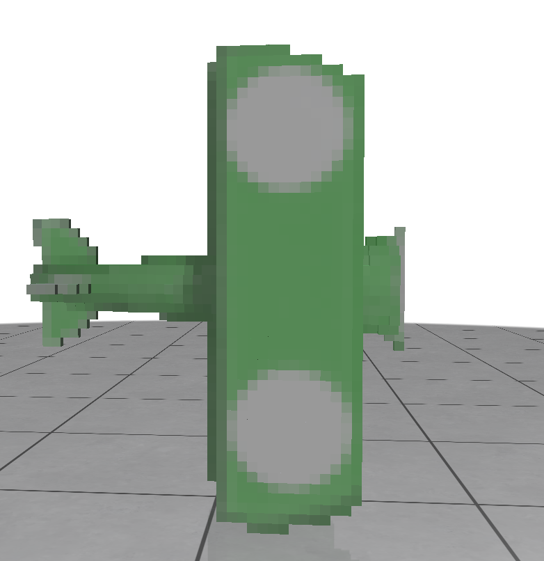

# Visual Feature Aggregation

A powerful library for visual feature aggregation based on FVDB (Fast Voxel DataBase), designed to process and visualize 3D structural features with efficient sparse tensor operations. This library enables advanced 3D feature processing and provides comprehensive visualization capabilities for analyzing aggregation results.

## 🌟 Features

- **Efficient Feature Aggregation**: Utilizes FVDB for high-performance sparse voxel operations
- **3D Visualization**: Real-time visualization of aggregated features using polyscope

## 📦 Installation

### Prerequisites

This library is built on top of FVDB. You need to install FVDB environment first before installing the specific dependencies for this project.

#### Step: Install Visual Feature Aggregation Dependencies

```bash
# Install the visual feature aggregation specific requirements
pip install polyscope  # For 3D visualization
# NOTICE: !!! must install torch_scatter, example: 
https://github.com/rusty1s/pytorch_scatter
```

## 🚀 Usage

### Basic Feature Aggregation

The main functionality is provided through two core scripts:

#### 1. Color Feature Aggregation

Process and aggregate visual features from multiple camera views:

```bash
python visual_feature_aggregation/aggregation_color.py \
    --image_path /path/to/your/image/data \
    --voxel_path /path/to/your/voxel/data.pkl \
    --fvdb_save_path ./result.pkl
```

**Parameters:**
- `--image_path`: Path to the directory containing multi-view images
- `--voxel_path`: Path to the preprocessed voxel data file
- `--fvdb_save_path`: Output path for the aggregated feature results

**I have provided an example data for testing.**

#### 2. Visualization of Results

Visualize the aggregated features using interactive 3D visualization:

```bash
python visual_feature_aggregation/visual_result.py
```

This will open an interactive 3D viewer showing the aggregated features with color mapping.

## 📊 Results



*Example of visual feature aggregation results showing color-coded voxel features in 3D space*

## 🤝 Acknowledgments

This project builds upon several excellent open-source projects:

### Core Dependencies
- **[FVDB](https://github.com/AcademySoftwareFoundation/openvdb)**: Fast Voxel DataBase for efficient sparse tensor operations
- **[TRELLIS](https://trellis3d.github.io)**: Structured 3D Latents for Scalable and Versatile 3D Generation
- **[Polyscope](https://polyscope.run/)**: Beautiful and flexible 3D visualization library

We express our gratitude to all the developers and researchers who have contributed to these foundational technologies that make this visual feature aggregation library possible. In addition, we also referenced code from [the SCube project’s implementation](<https://github.com/nv-tlabs/SCube/blob/main/scube/modules/gsm_modules/backbone/pure_3d_unet.py>).

## 📝 License

This project follows the same licensing terms as the underlying TRELLIS and FVDB projects. Please refer to their respective repositories for detailed license information.

## 🐛 Troubleshooting

### Common Issues

1. **CUDA Compatibility**: Ensure your CUDA version matches the installed packages
2. **Memory Issues**: Reduce batch size if encountering out-of-memory errors
3. **Visualization Issues**: Make sure you're not running on a headless server for visualization
4. **FVDB Installation**: Follow the exact installation steps for FVDB dependencies

For more detailed troubleshooting, please refer to the FVDB documentation or open an issue in this repository.


